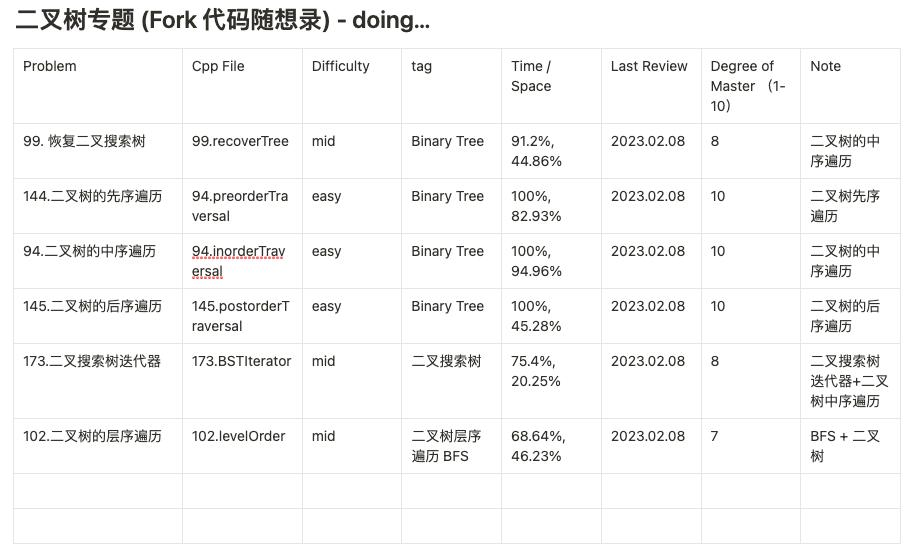
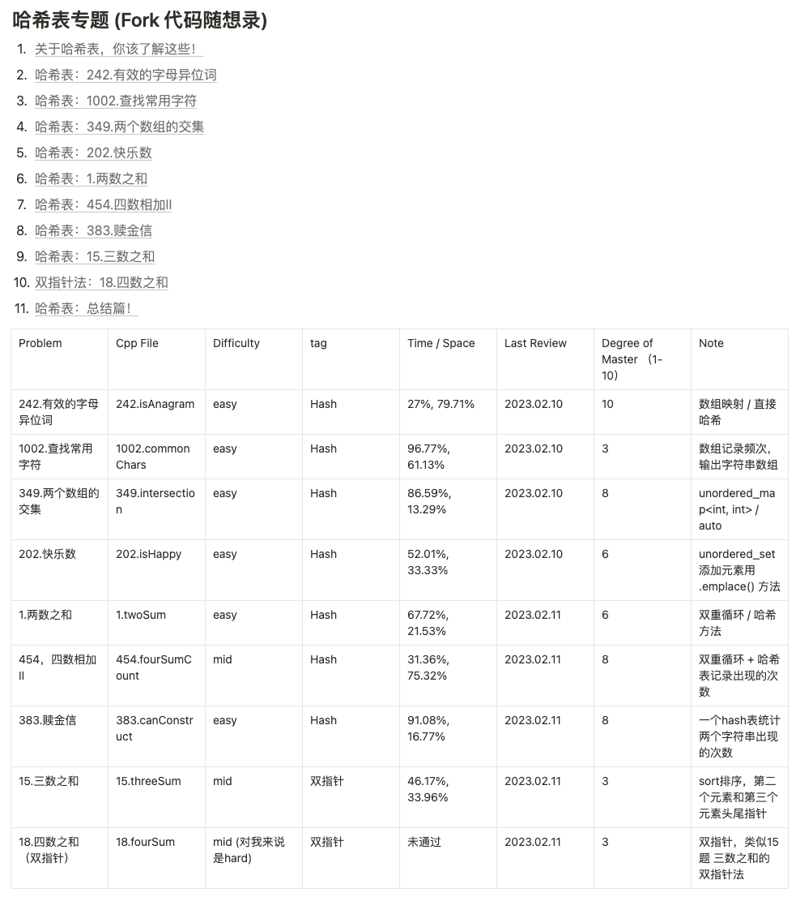
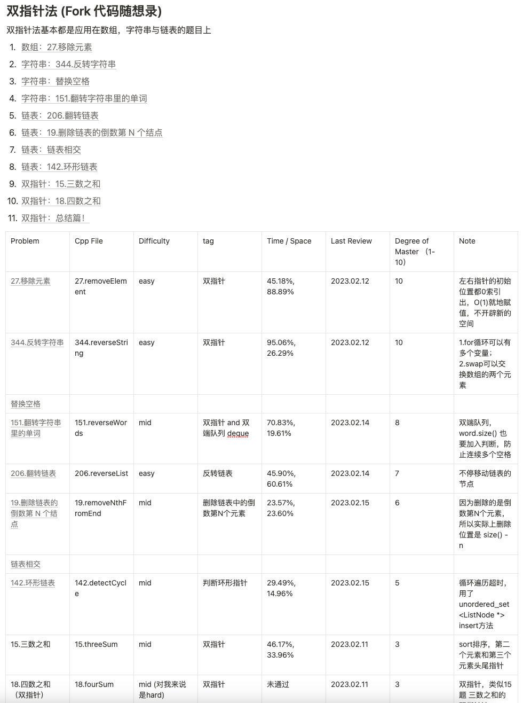

# leetcode-practice
`写在前面：走出去，去实习，先刷题。`

`现在时间和精力似乎越来越琐碎，但还是得静下心来好好刷算法题。`

`(Note: 本仓库根据代码随想录的专题划分刷题)`

---
#### 1. 题目列表

| 文件名 | 说明 | 更新时间🕙 |
| -------- | ----------- | ----- |
| 00. the-sword-to-offer | 剑指offer专题 | 2021-01-27 |
| 01. hot-100 | LeetCode热题Hot100 | 2022-01-16 |
| 02. BinaryTree | 二叉树专题 | 2023-02-08 |
| 04. Hash | 哈希表专题 | 2023-02-10 |
| 04. DoublePointer | 双指针专题 | 2023-02-12 |

---
#### 2. Notion笔记
- BinaryTree

- Hash

- DoublePointer

